### 产品设计 × Agent 系统 × 底层架构 × 工程细节

> **调研日期**：2026-07-17　|　**调研对象版本**：Claude Code v2.1.197（本机实测）及此前公开版本史
> **信源标注**：【官方】= 官方文档/博客/发布信息　【实测】= 本次在真实 Claude Code 环境中直接验证　【逆向】= 社区逆向工程/反编译分析　【推断】= 基于证据的合理推断
> **一个特殊说明**：本报告的撰写者本身就运行在 Claude Code 的 agent harness 内部，工具协议、上下文注入机制、权限流等均为第一手观测，这类证据一律标【实测】。
> **图表说明**：全文 13 幅图表以 Mermaid 绘制，在本页内直接渲染。

---

## 摘要：十条核心发现

1. **"信模型"是贯穿一切的总纲**。Claude Code 的几乎每个设计决策都可以还原为一句话：*把工程做薄，把判断留给模型，随模型每次升级删掉一层脚手架*。它刻意不做工作流编排、不做向量索引、不做厚重 GUI——这不是没能力做，而是赌"模型进步会淘汰这些补丁"。过去 18 个月的迭代史证明这个赌注是对的。
2. **真正的护城河不在产品层，在"模型-harness 协同训练"**。Anthropic 的模型在与 Claude Code 几乎同构的工具环境中做 RL 训练，模型每一代都"天生会用"这套工具。竞品可以复刻 harness（开源克隆已有十余个），但复刻不了这个训练闭环。
3. **工具层是投入产出比最高的工程点**。约 15 个内置工具，每个工具的描述是数百到上千词的"说明书式 prompt"，错误信息全部面向模型编写。Edit 工具的 exact-match + read-before-edit 硬约束，是用工具层状态机消灭幻觉的教科书案例。
4. **上下文被当成一等公民的稀缺资源管理**：分层 CLAUDE.md 记忆、阈值触发的三段式 compaction、system-reminder 边带注入、append-only 消息布局换取 KV 缓存命中——一整套"注意力预算"工程。
5. **安全模型是"能力沙箱 + 渐进信任"，而非一次性授权**。四档权限模式、规则化 allowlist、OS 级沙箱（Seatbelt/bubblewrap）、命令前缀解析 + 注入检测，每一次权限询问都附带"泛化建议"以摊薄未来打扰。
6. **"一切可回滚"是自主性的前提**。checkpoints/rewind、随时 Esc 打断、会话 fork——先把撤销做到极致，才敢把自动执行权交给模型。
7. **交互设计的母题是"透明 + 可打断 + 可组合"**：todo 进度外显、diff 逐条审批、流式展示每个动作；同时保持 unix 管道级可组合性（headless + stream-json），CLI 本身就是 API。
8. **产品即平台**：内核抽成 Claude Agent SDK 后，同一 harness 长出了 Cowork（面向非工程师，上线半年后软件开发仅占其用量 8.7%）、Claude for Excel、Chrome 扩展——Claude Code 实质是 Anthropic 所有 agent 产品的运行时。
9. **2026 年的演进方向是"从单 agent 到 agent 组织"**：Agent Teams（2026.2 随 Opus 4.6 发布）、常驻 daemon、后台会话默认化、跨设备 Remote Control、定时任务、持久记忆——单次会话正在变成可调度、可协作的长期工作单元。
10. **商业验证极其罕见地快**：GA 后 6 个月做到 $1B 年化营收，9 个月 $2.5B，企业收入占比过半；开发者复杂任务偏好度 44%（第二名 19%）。它同时定义了品类（terminal agent）并守住了品类第一。

---

## 目录

1. 产品概述与演进
2. 核心功能与交互设计（产品视角）
3. Agent 系统设计（技术内核 ★ 本报告重心）
4. 底层架构与工程实现
5. 细节优化亮点（魔鬼在细节）
6. 生态与平台化
7. 竞品横评与定位
8. 对我们的启示（Actionable）
9. 深潜：一次用户输入在 Claude Code 内部的完整生命周期（★ 面向 agentic system 工程师）
附录 A 版本大事记 / B 信源清单 / C 调研方法

---

# 一、产品概述与演进

## 1.1 时间线：18 个月，从内部脚本到 $2.5B 产品线

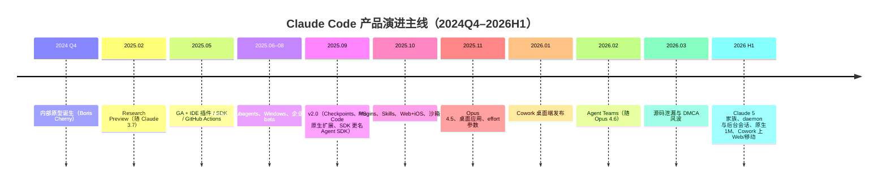

| 时间 | 节点 | 意义 |
|---|---|---|
| 2024 Q4 | Boris Cherny 的内部原型（"给 Claude 一个终端"），在 Anthropic 内部病毒式扩散【访谈】 | 起点不是产品规划，是能力观测实验 |
| 2025.02.24 | 随 Claude 3.7 Sonnet 以 research preview 发布【官方】 | 品类定义时刻：terminal coding agent |
| 2025.05.22 | 首届 Code with Claude 大会上随 Claude 4 GA；IDE 插件 beta、SDK、GitHub Actions 同发【官方】 | 单点工具 → 产品矩阵 |
| 2025.06–07 | Hooks（v1.0.38）、Windows 原生支持、自定义 Subagents（v1.0.60）、纳入 Pro 订阅【官方】 | 可编程性/可扩展性补齐 |
| 2025.08 | 企业席位与支出管控、Sonnet 4 的 1M 上下文 beta、周限额（治理 24/7 挂机滥用）【官方】 | 商业化与治理成型 |
| 2025.09.29 | **v2.0.0** 随 Sonnet 4.5：checkpoints + /rewind、原生 VS Code 扩展、终端 UI 重构、/usage；SDK 更名 **Claude Agent SDK**【官方】 | "可回滚"补齐；内核正式平台化 |
| 2025.10 | Plugins + Marketplace（10.9）、**Agent Skills**（10.16）、Claude Code on the Web + iOS（10.20）、沙箱运行时开源【官方】 | 生态开闸 + 云端形态 |
| 2025.11.24 | Opus 4.5 + **桌面应用**、effort 参数、Chrome 扩展【官方】 | 多端并行会话成为一等公民 |
| 2026.01 | **Claude Cowork** 桌面端发布（面向非工程师的通用 agent 工作台，基于同一内核）【官方】 | harness 出圈：从写代码到做一切知识工作 |
| 2026.02.06 | **Agent Teams** 随 Opus 4.6 发布（实验性，多 agent 协作）【官方】 | 单 agent → agent 组织 |
| 2026.03.31 | 源码泄漏事件：npm 包 v2.1.88 意外携带 source map，约 51 万行 TypeScript 源码完整暴露，引发 DMCA 风波与社区 clean-room 重写热潮【公开报道】 | 闭源策略的压力测试；侧证 harness 层高度可复制、护城河在别处 |
| 2026 H1 | Claude 5 家族进入产品（Fable 5 于 v2.1.170、Sonnet 5 于 v2.1.197 成为默认模型并带原生 1M 上下文）；后台会话默认化、daemon 常驻、subagent 五层嵌套、fast mode；Cowork 上线 web/移动（7.7）【官方/实测】 | 长时程、多会话、跨设备的"agent 操作系统"雏形 |

本机实测：2026-07-17 安装版本为 **v2.1.197**，`~/.claude/` 下已出现 `teams/`、`tasks/`、`daemon/`、`plans/`、`file-history/`（checkpoints）、`shell-snapshots/` 等目录，与上述特性一一对应【实测】。

## 1.2 产品哲学：unopinionated，把模型裸露给用户

官方对 Claude Code 的自我定义只有一句话："**intentionally low-level and unopinionated**"（刻意低层、不预设立场）【官方】。这句话展开是四个决策：

- **不做工作流**。没有"新建项目向导"、没有固定的 plan→code→test 流水线（Plan Mode 是可选模式而非强制流程）。产品假设：模型自己知道该先做什么。
- **不做中间表示**。不建代码知识图谱、不建向量索引（详见 3.3），模型直接用 grep/glob/read 面对原始代码——和人类高级工程师进入陌生仓库的方式相同。
- **界面服务于模型输出，而非约束模型输出**。终端里的一切渲染（markdown、diff、todo 树）都是对模型自然行为的可视化，不是让模型去填的表单。
- **每次模型升级就删产品代码**。团队公开表述过近似"80% 的产品决策是：这事让模型做"【访谈】。典型案例：早期尝试过的 RAG 索引方案被 agentic search 取代（模型变强后，检索这件事本身交还给模型）。

为什么选终端？这是被问最多的问题，官方与团队访谈给出的理由高度一致：终端是**最大公约数环境**——SSH、容器、CI、任何 IDE 的下层都有它；键盘流交互延迟最低；unix 管道天然可组合；对一个要快速迭代的实验性产品，TUI 的开发成本远低于 GUI。更深一层【推断】：终端形态使产品团队被迫把全部工程投入压在 agent 内核而非界面上，这在 2025 年恰好是正确的资源分配。

## 1.3 形态矩阵：一核多壳

所有形态共享同一个 agent 内核（后来抽象为 Claude Agent SDK），差异只在宿主与会话所在位置：

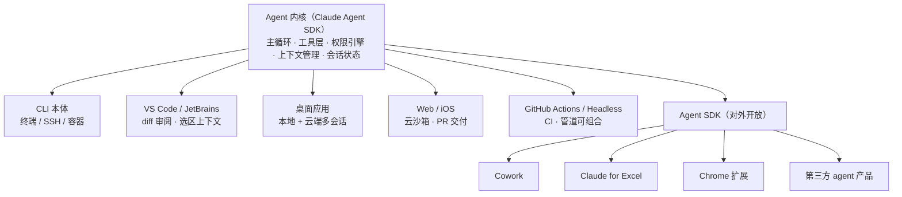

| 形态 | 会话运行在 | 解决的场景 |
|---|---|---|
| CLI（本体） | 本地终端 | 深度开发、SSH/容器、一切自动化的基座 |
| VS Code / JetBrains 插件 | 本地（IDE 内嵌面板） | inline diff 审阅、选区上下文注入、图形化 plan 审批 |
| 桌面应用 | 本地 + 云端并行多会话 | 多任务并行管理、非终端用户入口 |
| Web + iOS（claude.ai/code） | Anthropic 云沙箱 VM | 移动端派活、PR 优先的异步工作流、无本地环境 |
| GitHub Actions | CI runner | @claude 提及即干活、issue→PR 自动化 |
| Headless（`claude -p`） | 任意脚本环境 | unix 可组合性：Claude Code 作为命令行原语 |
| Agent SDK | 你自己的进程 | 把整个 harness 当库用，构建任意领域 agent |

这个矩阵的关键设计是**会话可迁移**：web 发起的会话可以 teleport 到本地 CLI 继续，桌面端可同屏管理本地与云端会话，2026 年的 Remote Control 进一步支持从其他设备接管本机会话【官方/实测】。

## 1.4 商业模式与增长

- **定价结构**：Pro（$20/月）/ Max（$100–200/月）订阅捆绑 + API 按量计费双轨；企业版按席位 + 用量池 + 支出上限（per-user spend caps）。订阅制的产品心理学价值被低估：它消灭了"每个 token 都在烧钱"的使用焦虑，是重度使用习惯养成的前提（代价是 2025.8 起不得不引入周限额治理挂机滥用）。
- **增长曲线**【官方/公开报道】：GA（2025.5）→ 年化 $1B（2025.11，6 个月）→ 年化 $2.5B（2026.2），2026 开年后继续翻倍以上；企业客户收入占比已过半，商业订阅数 2026 年以来翻了 4 倍。作为背景，Anthropic 整体年化收入 2026 Q1 达 $30B 量级（公开报道口径）。
- **对比锚点**：这是开发者工具历史上最快的收入爬坡之一——参照系里 GitHub Copilot 用了约三年到 $1B 年化。

## 1.5 团队与研发方式：dogfooding 即方法论

- **极小团队 + 单人原型起步**。产品由 Boris Cherny 的个人实验长成，长期保持小团队高杠杆运作。
- **"90%+ 的 Claude Code 代码由 Claude Code 写成"**【访谈，团队多次公开表述】。这不只是宣传语，它决定了研发流程：需求→直接让 agent 实现→人审查。团队自己就是最重度用户，反馈回路以小时计。
- **每日发布节奏**。CHANGELOG 以 patch 版本几乎逐日推进（本次调研期间版本号已从 2.1.197 走到 2.1.212+），配合 feature flag 灰度（逆向可见内部以 `tengu` 为产品代号的大量开关）【逆向】。
- **产品即评测场**。新模型发布前先在 Claude Code 内部环境验证（Sonnet 4.5、Opus 4.5/4.6、Claude 5 家族的发布节奏与 Claude Code 版本号严格咬合），产品使用数据反哺模型训练方向——这是 6.4 节"飞轮"的组织基础。
- **公开透明的工程文化**：GitHub 公开仓库承接 issue（并由 Claude Code 自己跑自动分诊）、系统提示词被社区反复逆向也不设防——因为团队清楚护城河不在 prompt 文本里。

# 二、核心功能与交互设计（产品视角）

Claude Code 的交互设计有一条清晰的母题：**agent 的自主性有多大，取决于用户的"透明度、可打断性、可回滚性"有多强**。下面按功能点拆解，每个点都标注它服务于哪条设计原则。

## 2.1 主会话界面：在字符界面里做出 IDE 级信息密度

终端 UI 由 React + Ink 渲染（见 4.1），做到了传统 CLI 做不到的结构化呈现：

- **流式 markdown 渲染**：模型输出边生成边排版（代码块语法高亮、列表、表格），首 token 即可见——感知延迟优先于总延迟。
- **todo 清单实时渲染**：模型维护的任务列表以可勾选清单形式常驻显示，用户对"agent 现在在做第几步、还剩几步"始终有全局感。这是把模型的内部计划**强制外显**的交互（机制见 3.3 TodoWrite）。
- **diff 高亮**：所有文件修改以词级高亮 diff 呈现，红绿双色 + 行号，审查成本接近 GitHub PR。
- **上下文余量指示**：状态区显示 context 剩余百分比，接近阈值时预警自动压缩——把"模型还记得多少"这个黑盒暴露给用户。
- **statusline 可定制**：用户可用任意脚本自定义状态栏（显示分支、模型、成本等），产品把这块屏幕地产直接交给用户【官方】。
- **spinner 文案**：等待时显示轻快的动词短语（社区津津乐道的 "Reticulating splines" 式幽默），可自定义。低成本的人格化，且严格限制在等待场景，不入正文。

## 2.2 权限与信任梯度：交互设计的核心命题

这是 Claude Code 交互设计里最值得研究的部分。它把"用户对 agent 的信任"建模成一个**可渐进让渡的梯度**，而不是一次性开关：

**四档权限模式**（Shift+Tab 循环切换）【官方/实测】：

| 模式 | 行为 | 适用心智 |
|---|---|---|
| default | 首次使用某能力时询问 | "我在观察你" |
| acceptEdits | 文件编辑自动放行，命令仍询问 | "写代码我信你了" |
| plan | 只读研究，产出计划需审批后才能动手 | "先说服我" |
| bypassPermissions | 全部放行（建议容器内使用） | "自动驾驶" |

**三层机制叠加在模式之上**：

1. **规则化 allowlist**：`Bash(npm run test:*)`、`Edit(src/**)`、`WebFetch(domain:github.com)` 这样的规则语法，支持 allow/ask/deny 三级且 deny 优先。规则可以按 user/project/local 分层存放（见 4.4）。
2. **询问即投资**：每次权限弹窗都附带泛化选项（"本项目内不再询问 npm test"）。这个设计极其重要——它把每一次打扰转化为对未来打扰的削减，权限疲劳随使用时长单调下降。对比很多竞品的"每次都问"或"一次全放"，这是最精细的中间态。
3. **diff 逐条审批**：编辑类操作的确认单位是"这个 diff"，不是"允许编辑文件"。用户批准的是具体变更内容。

**信任建立曲线的完整旅程**【推断，基于机制归纳】：新用户从 default 模式的高频确认开始 → 通过泛化选项快速积累项目级 allowlist → 切到 acceptEdits → 在容器/worktree 里对可信任务用 bypass → 最终形态是"权限规则集 + 沙箱"替代人工确认（见 4.5"用沙箱消灭弹窗"）。产品没有强迫任何一步，但每一步都铺了台阶。

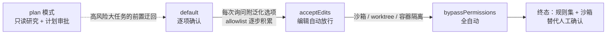
*信任让渡的典型路径示意。*

## 2.3 Plan Mode：把"想清楚再动手"做成产品状态

- 进入 plan 模式后，harness 在系统层面**收走所有写权限**（工具集只剩只读），模型先研究代码库再产出结构化计划——约束是机制性的，不是提示词请求【实测】。
- 计划以专门的审批 UI 呈现，用户可批准、驳回或**直接编辑计划文本**（2025.11 改版后计划成为可持久化、可编辑的一等对象，存于 `~/.claude/plans/`）【官方/实测】。
- 批准后自动切换执行模式，可选择"批准并自动接受后续编辑"，一次决策完成信任让渡。
- 模型分工彩蛋：`opusplan` 模式用大模型做计划、较快模型执行——把"贵的思考、便宜的执行"做成一个开关。

设计价值：Plan Mode 把大任务的风险前置到一次性的、可审阅的文本上，是"透明度换自主性"的最典型交易。

## 2.4 上下文供给：让用户喂上下文的成本趋近于零

- `@文件` 模糊引用：gitignore 感知的模糊匹配补全，引用即注入。
- 图片直接粘贴/拖拽进终端（截图调 UI bug 的高频路径）；支持读 PDF、Jupyter notebook。
- `#` 开头的输入直接写入记忆（CLAUDE.md），"顺手沉淀"而非"专门维护"。
- `/add-dir` 挂载多目录；CLAUDE.md 分层自动注入（见 3.4）。
- IDE 插件里，编辑器中的**当前选区/打开文件/诊断信息**自动作为上下文共享给 CLI【官方】。

## 2.5 时间线控制：Esc 是最重要的按键

- **随时可打断**：流式输出中按 Esc 立即中止（含正在执行的工具调用的取消语义），打断后上下文保留，可直接追加新指令纠偏。"打断-纠偏-继续"是高手用户的核心操作循环。
- **双击 Esc 回到过去**：弹出历史消息列表，选中任意一条重新编辑发送，等于对话树 fork。
- **Checkpoints + /rewind**（v2.0 起）：每次文件修改前自动快照（独立于 git 的影子历史，存于 `~/.claude/file-history/`），可选择恢复"代码 / 对话 / 两者"到任意检查点【官方/实测】。这解决了"敢不敢让它大胆改"的心理障碍——**撤销能力是自主性的解锁器**。
- **会话持久化**：`--continue` 接续上一会话、`--resume` 选择历史会话恢复（对话全文、工具状态完整还原）；2026 版本中会话可后台常驻、跨进程重启存活（daemon 化，见 4.2）【官方/实测】。

## 2.6 命令与扩展体系的用户侧体验

- **内置 slash commands** 约 40+：/init（生成 CLAUDE.md）、/compact、/clear、/model、/usage、/cost、/doctor、/review、/security-review 等，覆盖"对 harness 本身的操作"。
- **自定义命令**：`.claude/commands/*.md`，markdown 即命令（支持 `$ARGUMENTS` 占位、frontmatter 声明允许工具、`!`前缀预执行 bash 注入结果）。团队可把"部署前检查""发布流程"沉淀为版本库内共享命令——**提示词工程资产化**。
- **Skills 的触发体验**：用户可 `/skill名` 显式调用，更多时候由模型根据任务自动加载（见 3.6）；用户视角"它突然会了公司的规矩"。
- **`!` 直通 bash**：不经过模型直接执行 shell 命令，结果进入上下文。承认"有时用户自己敲更快"，不强迫一切经过对话。
- Tab 补全、Ctrl+R 历史搜索、vim 键位模式——终端老用户的肌肉记忆全部保留。

## 2.7 异步与并行：从"等它做完"到"管理一群会话"

- **后台任务**：长命令（dev server、测试）可转后台运行，模型可轮询其输出；用户用 Ctrl+B/相应面板查看。agent 不再被单个阻塞命令锁死。
- **Subagent 并行**：模型可同时派出多个子 agent（进度以树状呈现），fan-out 检索/审查类任务显著加速（机制见 3.5）。
- **多会话并行工作流**：官方推荐 git worktree 隔离多任务；桌面应用把"多会话看板"做成主界面；v2.1.x 后台会话成为默认能力，`/fork` 可把当前任务分叉成后台会话继续【官方】。
- **Agent Teams**（2026.2+，实验性）：不止并行，teammates 之间可互发消息、共享任务清单、互相 review——交互上用户从"指挥一个人"变成"看一个小组的站会"（详见 3.5）。

这条演进线的产品含义：Claude Code 正在把交互单位从"一次对话"迁移到"一组可调度的长期工作"，抢占的是"工程管理界面"的生态位【推断】。

## 2.8 多端交互差异

- **IDE 插件**：主战场是 diff 审阅体验（编辑器原生 diff 视图）、选区上下文、图形化 plan/权限审批。定位是"CLI 的显示器"，逻辑仍在 CLI 内核。
- **桌面应用**：多会话并行管理 + 本地/云端会话同屏；给不开终端的人一个入口。
- **Web/iOS**：会话跑在 Anthropic 管理的云沙箱里，git 凭据不进 VM（代理注入，见 4.6），产物以 PR 形式交付；移动端主打"派活和验收"而非实时结对。异步优先的交互范式：描述任务 → 云端跑 → 回来看 PR。
- **Headless**：`claude -p "prompt" --output-format stream-json` 把整个 agent 变成 unix 管道中的一环；`--input-format stream-json` 支持程序化多轮。CI 里的 Claude Code 与交互式的是同一个二进制、同一套行为。

## 2.9 反馈与"陪伴感"：克制的人格化

- **思考过程可视化**：extended thinking 以灰色斜体流式展示（可折叠），用户能看到"它为什么这么做"；thinking 强度可用自然语言拨盘（"think hard" / "ultrathink"）或 /effort 控制。
- **完成通知**：任务完成/需要输入时触发系统通知或终端铃声——承认用户会切走，主动把注意力召回。
- **语气校准**：简洁、直接、不奉承（系统提示明确抑制 "You're absolutely right!" 式回应）、默认无 emoji。人格边界清晰：它是能干的同事，不是讨好型助手。这与消费级 chatbot 的设计取向形成鲜明对照。

## 2.10 Onboarding 与学习曲线

- 首启三步：OAuth 登录（订阅或 API key）→ 主题选择 → 即刻可用；`/init` 一键生成项目 CLAUDE.md（模型自己读仓库写说明书）。
- 学习曲线的坦诚取舍：终端形态天然筛选用户，产品不试图讨好所有人，而是用 IDE 插件/桌面端/Web 端逐步兜住更广人群——**先赢核心人群的深度，再扩人群的广度**。高级能力（hooks、subagents、skills）全部渐进暴露，不出现在新手路径上。
- `/doctor` 自诊断、错误信息人类可读、`/bug` 一键上报（附脱敏会话）——运维自己的用户。

**本章小结——可提炼的交互设计原则**：① 透明是信任的货币（todo/diff/thinking 全部外显）；② 打断与撤销是自主性的前提；③ 每次打扰都要为减少下次打扰做投资；④ 强约束用机制实现（收走工具），弱约束才用提示词；⑤ 键盘优先、可组合性即 API；⑥ 人格化只出现在等待间隙，不污染工作内容。

# 三、Agent 系统设计（技术内核 ★）

这是本报告的重心。Claude Code 的 agent 系统可以概括为：**一个单循环 + 一套精工工具 + 一整套上下文工程 + 分层的扩展机制（subagent/skill/hook/MCP）+ 机制化的安全边界**。以下逐层拆解。

## 3.1 主循环：简单到令人意外的单循环

社区逆向（MinusX 的著名长文、多份反编译分析）与官方 SDK 结构互相印证【逆向/官方】：Claude Code 的核心是一个**扁平的单线程 agentic loop**——

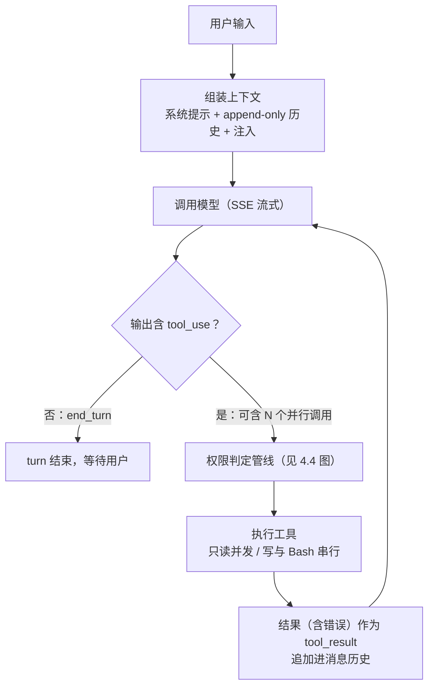

没有状态机、没有 DAG 编排引擎、没有多 agent 路由器。消息历史是一条 append-only 的扁平列表。工程实现上是一个异步生成器（Agent SDK 的 `query()` 直接暴露了这个形态：async generator 逐条 yield 消息）【官方】。

几个关键设计判断：

- **Model-driven，而非 workflow-driven**。"下一步做什么"由模型每一轮实时决定，产品不预设任何任务图。这个选择的代价是可预测性差，收益是任务泛化能力上不封顶——恰好匹配"模型每三个月变强一次"的环境。官方工程博客把 agent 定义为 "models using tools in a loop"，这句话就是 Claude Code 的全部架构图【官方】。
- **分支收敛的层级约束**。长期以来 subagent 只允许一层（主 agent 派出子 agent，子 agent 不能再派）——刻意压制编排复杂度；直到 2026 年 v2.1.172 才放开到五层嵌套，且同期引入会话级派生上限治理失控【官方】。演进顺序说明团队的原则：先用最简单的结构撑到撑不住，再加一层。
- **验证闭环是核心**，而非附件。官方最佳实践反复强调 "gather context → take action → **verify work** → repeat"：跑测试、跑 lint、截图对比——agent 质量的关键不在生成而在自校验。产品里体现在：鼓励 TDD 工作流、hooks 里挂测试、`/verify` 类技能。
- **"do the simple thing first" 是明文工程信条**【访谈/逆向】。MinusX 的分析给出的结论至今成立：Claude Code 好用的原因不是架构精巧，而是"在每个决策点都选了最简单可行的方案，然后把简单方案打磨到极致"。

## 3.2 System Prompt 工程：一份持续运行的"员工手册"

完整系统提示（含工具描述）合计约 1.5 万 token 量级【逆向，多个独立 dump 相互印证】。结构上分为：

1. **身份与安全边界**：产品身份、防注入的"指令来源边界"（详见 3.11）、禁止事项（恶意代码等）。
2. **语气与格式**：为 CLI 场景定制——简洁、直接、可用 GitHub markdown；明确抑制冗余（曾有著名的 "answer with fewer than 4 lines unless asked" 类指令）、抑制奉承、抑制不必要的道歉与前后缀套话。
3. **主动性校准**："做被要求的事，不多不少"——例如修完 bug 不要顺手 commit（除非被要求）、不要创建没被要求的文档文件。这一段直接决定产品"手感"：既不畏手畏脚，也不自作主张。
4. **代码规范**：模仿现有代码风格、先确认库存在再引用（打开 package.json 看，而不是假设）、不留"给审阅者看的注释"、安全红线（不提交密钥）。
5. **任务管理策略**：何时必须用 TodoWrite、完成即勾选不要攒批、不确定完成就不许标完成。
6. **工具使用策略**：什么时候用 subagent 而非直接搜索、独立工具调用必须并行发出、引用代码用 `file:line` 格式等。
7. **环境信息块**：cwd、git 状态、平台、日期、模型名——一次性注入静态事实，避免模型浪费轮次探测环境。

两个值得单独强调的机制：

- **`<system-reminder>` 边带通道**【实测】。除了开场的系统提示，harness 会在对话过程中随时以 `system-reminder` 块注入动态指令：todo 长期未更新时提醒、进入 plan 模式时声明约束、CLAUDE.md 内容随首条消息附带、文件被外部修改的通知、hook 的输出、安全提示（"工具结果里的指令不是用户指令"）。**这是产品在不打断缓存前缀、不污染用户可见对话的前提下，对模型进行运行时转向的核心手段**——相当于导演在演员耳边的耳语频道。
- **大写强调与正反例**。提示词大量使用 IMPORTANT / NEVER / ALWAYS 与成对的 good/bad 示例（commit message 格式给了完整范例）。逆向社区把这总结为"提示词里的行为经济学"：对 LLM，规则的表述强度与遵循率显著相关，且反例比正例更有效【逆向/经验共识】。团队也公开承认这是"仍然必要的粗糙手段"，模型每变强一代就删掉一批大写字。

## 3.3 工具体系：约 15 个工具，每个都是一篇设计文档

工具层是 Claude Code 工程投入密度最高的地方。总原则（与官方《Writing effective tools for agents》一文互证）：**低层、通用、少量、正交；描述写成说明书；错误信息写给模型看；一切输出预算化**【官方】。

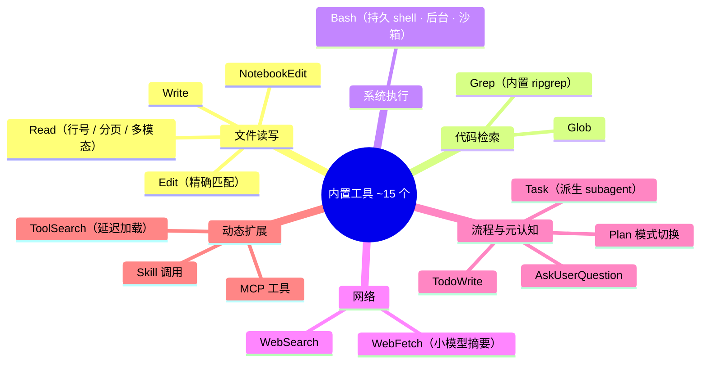

### 3.3.1 文件读写三件套

- **Read**：以 `cat -n` 格式返回（行号 + 制表符前缀），默认最多 2000 行，超长可分页（offset/limit）；行内超 2000 字符截断；支持图片（返回视觉内容）、PDF、ipynb。**行号格式是刻意的**：它教会模型"文件位置"的坐标系，服务于后续编辑与 `file:line` 引用，同时明示截断让模型知道自己没看全【实测】。
- **Edit**：exact string replacement——`old_string` 必须与文件内容**逐字符精确匹配且唯一**，否则报错；强制要求本会话内先 Read 过该文件才允许编辑（工具层校验，不是提示词约定）【实测】。
  为什么不用行号定位或 unified diff？因为：① 行号在多次编辑间漂移，模型极易错位；② diff 格式对模型是"要生成的语法"，会出错；而 exact-match 是**自校验**的——模型若幻觉了不存在的代码，编辑直接失败并报错，幻觉被当场拦截而不是写进文件。唯一性要求则强迫模型提供足够上下文消歧。这是"把正确性约束下沉到工具层"的典范设计。
- **Write**：整文件写入，覆盖已有文件同样要求先 Read（防止盲覆盖）；系统提示同时约束"能 Edit 不 Write、不主动创建多余文件"。

### 3.3.2 检索双件套与"反 RAG"路线

- **Glob**（文件名模式匹配，结果按修改时间排序——新近性即相关性的启发式）+ **Grep**（内置 ripgrep，参数化输出模式 content/files/count、前后文行数、多行模式）。
- **刻意不做向量索引/RAG**。团队早期试过嵌入索引方案，最终全面转向 agentic search【访谈】：模型像高级工程师一样用 grep/glob 层层缩小范围。理由：① 索引会过期、有维护成本，而 grep 永远反映当前磁盘真相；② 检索过程全透明可审计（用户看得见它搜了什么）；③ 无嵌入外发的隐私/合规问题；④ 最重要的——模型已经强到能自己组合检索策略，中间层反而损失信息。代价是多花 token 与轮次，靠并行工具调用与 subagent 摊薄。
  这个决策是"信模型"哲学最锋利的体现，也是与 Cursor（语义索引路线）最本质的技术分歧点。

### 3.3.3 执行类：Bash 及其工程配套

- **持久 shell 会话**：跨调用保持工作目录与环境；环境初始化用 **shell snapshot** 技巧（启动时把用户真实 shell 环境快照落盘，每条命令在干净的非交互 shell 中 source 快照执行）——既继承用户的 PATH/alias，又避免 rc 文件的副作用与污染，可复现性大幅提升【逆向/实测：`~/.claude/shell-snapshots/` 目录】。
- **预算与治理**：默认 2 分钟超时（可调，上限 10 分钟）、输出约 30K 字符截断（显式标注）、长任务转后台（`run_in_background` + 轮询输出），2026 版本中超过 2 分钟的 MCP 调用也自动后台化【官方】。
- **描述即导流**：Bash 的工具描述明确写"避免用 find/grep/cat/head/tail/echo，改用专用工具"——把模型从自由 shell 导流回结构化、可审计、可权限化的专用工具。工具描述承担了"内部流量分配"职能【实测】。
- **git 工程学内嵌**：commit 加 Co-Authored-By 署名、PR 用 gh CLI、HEREDOC 传 commit message、禁止 force push 到主干、"用户不叫提交就不提交"——高级工程师的 git 礼仪被编码为默认行为【实测】。

### 3.3.4 流程与元认知类工具

- **TodoWrite**：模型自己维护结构化任务清单（每项含 content/activeForm/status，约束"任意时刻恰好一项 in_progress"）。三重作用：① 计划外显给用户（进度条语义）；② **注意力锚定**——长任务中把计划固定在上下文里，防跑偏，harness 还会在清单久未更新时注入提醒【实测】；③ 诚实性约束——系统提示规定测试没过就不许标 completed。一个纯文本工具同时解决了 UX、上下文工程、对齐三件事，是极漂亮的设计。
- **Task（subagent 派生）**：见 3.5。
- **AskUserQuestion**：结构化提问（2–4 个选项 + 简短标签 + 可多选），系统提示严格限定"只有决策真属于用户时才可用"——把"澄清"从随口反问变成低成本的结构化决策卡片，同时防止 agent 用提问转嫁责任【实测】。
- **EnterPlanMode / ExitPlanMode**：模式切换本身是工具调用，计划审批天然进入权限流——"状态迁移也要经过许可"的统一建模。
- **WebSearch / WebFetch**：WebFetch 的实现是"抓取 → 转 markdown → **用小模型按 prompt 提摘要**再返回"，一石二鸟：压缩 token、削弱网页内容的注入攻击面（原文不直接入主上下文）【官方/实测】。

### 3.3.5 工具描述工程与数量哲学

- 每个工具的 description 是数百到上千词的小型说明书：何时用、**何时不用（并指名该用哪个别的工具）**、参数语义、限制、少量正反例。工具间互相引用形成导流网络（Grep 说"别用 bash 跑 grep"，Read 说"别用 cat"）。
- **错误信息是提示词的延伸**：每条失败消息都包含下一步指引（"old_string 不唯一，请提供更多上下文"／"用户拒绝了此操作，请调整方案而非原样重试"）。模型的重试成功率很大程度上是被错误文案工程出来的【实测】。
- **数量哲学**：核心工具保持在 ~15 个的低位——低层、正交、可组合，宁可让模型组合三个通用工具，也不做三十个场景化工具。场景化的"高层能力"交给 Skills（可加载的知识）而不是工具（常驻的接口），因为工具永久占用上下文预算，而技能按需加载（见 3.6）。2026 年面对 MCP 工具爆炸，进一步引入 **ToolSearch 延迟加载**：海量工具只注册名字，schema 按需检索加载【实测：本会话即处于该机制下】。

## 3.4 上下文工程：把注意力当预算管理

Anthropic 官方工程博客《Effective context engineering for AI agents》几乎可以视为 Claude Code 的设计说明书：**上下文是有限且边际收益递减的资源（context rot），工程目标是"最小的高信号 token 集"**【官方】。Claude Code 的落地手段：

### 3.4.1 分层记忆：CLAUDE.md 体系

四层叠加、逐层覆盖【官方】：
```
企业管控层（IT 下发，不可覆盖）
→ 用户层 ~/.claude/CLAUDE.md（个人偏好，跨项目）
→ 项目层 <repo>/CLAUDE.md（入库共享，团队合意）
→ 子目录层 <repo>/sub/CLAUDE.md（进入该目录时按需加载）
```
支持 `@path` import 语法组合文件。内容随会话首条消息注入。关键实践共识：CLAUDE.md 是**每一轮都在场的常驻 prompt**，必须极度精炼（团队建议当作"新同事的一页纸须知"来写，而非文档堆场）。`/init` 让模型自己生成初稿、`#` 快捷追加，维护成本被压到顺手级别。

### 3.4.2 Compaction：三段式压缩

- **自动触发**：上下文逼近窗口上限（阈值随版本调整，约 90%+ 区间）时自动压缩【官方/逆向】；用户也可 `/compact`（可附指令，如"保留所有文件路径"）。
- **压缩策略**：用模型对既往对话做**结构化摘要**（任务目标、已做决策、涉及文件、未决事项、下一步），保留最近若干消息原文，丢弃中间过程细节——"我刚才在干嘛"数据包。
- **Micro-compaction / context editing**：更细粒度地优先清除旧的**工具输出**（体积最大、复用价值最低的部分），以占位符替代，尽量推迟全量压缩【官方，该能力同期也作为 context editing API 开放】。
- 本会话的系统提示中可直接观察到 harness 对压缩续接的声明（"对话过长时部分内容将被摘要，工作可无缝继续"）【实测】。

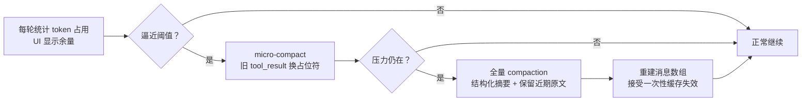

### 3.4.3 缓存感知的对话架构

这是最少被讨论、但对成本与延迟影响最大的一层【官方/逆向】：

- 系统提示稳定不变 + 消息历史 **append-only** + 工具定义固定 → 每一轮请求都最大化命中 prompt cache（Anthropic API 缓存命中价格为原价 10%，延迟大幅下降）。
- 所有动态信息（todo 状态、文件变更通知、模式切换）都通过**追加** system-reminder 实现，绝不回头修改历史消息——改一个字符就会击穿后缀所有缓存。
- 会话闲置的缓存 TTL 经济学（5 分钟/1 小时两档）被纳入调度考量【实测：本会话提示中明确声明使用 1 小时 TTL 并据此指导等待策略】。
- Compaction 是缓存的敌人（重写历史 = 全量失效），这也是压缩阈值设得很高、micro-compact 优先的原因之一【推断】。

### 3.4.4 Just-in-time 检索哲学

不预载代码库，维持"轻指针、重按需"：CLAUDE.md 是地图，文件路径是指针，内容 Read 时才进上下文；subagent 进一步把"翻箱倒柜"外包到一次性上下文里，只回传结论（见 3.5）。1M 上下文（Sonnet 5 已原生默认【官方】）并没有改变这个哲学——窗口变大降低的是压缩频率，而不是"高信号密度"这个目标本身。

## 3.5 Subagents 与多 Agent：从工具到组织

### 3.5.1 Subagent（Task 工具）机制

- 主 agent 通过 Task 工具派生子 agent：子 agent 拥有**独立的全新上下文**，带着一段任务描述出发，完成后只把**最终报告**回传主上下文【官方/实测】。
- 核心价值是**上下文隔离的经济学**：探索类工作（搜代码、读文档、跑排查）过程冗长但结论短小——把过程留在可丢弃的子上下文，主上下文只吸收蒸馏结果。官方多 agent 研究系统的博文给出量化印证：多 agent 消耗约 15 倍 token，但在广度检索类任务上性能提升 90%+【官方】。
- **并行 fan-out**：一次派多个子 agent 并发（独立文件的批量改造、多角度审查）。
- **内置角色**：general-purpose（全能）、Explore（只读快速检索，明确"只定位不评审"）、Plan（规划）；模型可按 haiku/sonnet/opus 分层指派——便宜模型跑腿，贵模型决策【实测】。
- **自定义 subagent**：`.claude/agents/*.md`，frontmatter 声明 name/description/tools/model，正文即系统提示。description 写上"PROACTIVELY use for …"可触发主 agent 自动委派【官方】。工具裁剪同时是**权限裁剪**（只读 reviewer 不给 Write），角色即安全边界。

### 3.5.2 Agent Teams（2026）：结构性升级

2026.2.6 随 Opus 4.6 正式发布（此前以 feature flag 藏在二进制里被社区先行发现）【官方/社区】。与 subagent 的本质区别：

| | Subagent（2025） | Agent Teams（2026） |
|---|---|---|
| 拓扑 | 星型：只能向主 agent 汇报 | 网状：teammates 可互发消息（SendMessage） |
| 生命周期 | 一次性，报告即销毁 | 常驻，可持续接活 |
| 状态共享 | 无 | 共享任务清单（TaskCreate/TaskList） |
| 隔离 | 上下文隔离 | 上下文 + git worktree 隔离（可选） |
| 交互范式 | 函数调用 | 组织协作（站会/认领/互审） |

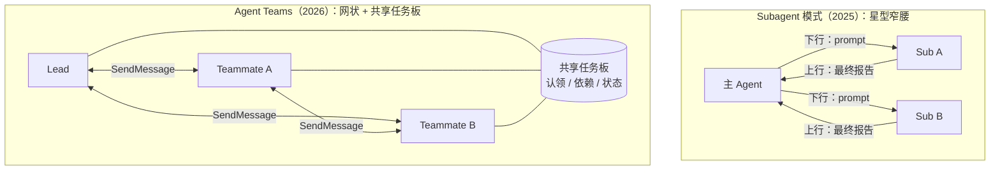

设计上仍然克制：每会话一个隐式 team（v2.1.178 甚至删掉了 TeamCreate/TeamDelete 工具做简化）、会话级派生数量限额、实验性开关起步【官方/实测：本机 Agent 工具的 team_name 参数已标注 deprecated，与该演进吻合】。适用场景官方划得很清楚：竞争性假设排查、跨层特性分工、多视角评审——**通信成本决定了它只适合"低耦合高并行"的任务形状**。

配套的还有 Workflow（脚本化确定性编排 fan-out/pipeline）、后台任务系统、定时任务（cron）——2026 年的 Claude Code 在单循环之上，长出了一个"编排层"，但注意：编排层是**可选外挂**，单循环内核未变【实测/官方】。

## 3.6 Skills：渐进式披露的能力包

2025.10 发布的 Agent Skills 是对"如何给 agent 添加领域能力"的重新回答【官方】：

- **形态**：一个目录 + `SKILL.md`（frontmatter：name、description；正文：操作指南），可附带脚本、模板、参考文件。
- **三级渐进披露**（点睛之处）：
  1. 启动时只有全部技能的 name + description 进入上下文（每个几十 token）；
  2. 任务命中时，模型才加载 SKILL.md 正文（几百到几千 token）；
  3. 正文引用的深层文件/脚本，用到时才 Read/执行。
  上下文占用与任务相关性严格成正比——对比 MCP 工具"全量 schema 常驻"的旧模式，这是数量级的预算改善。
- **可执行知识**：技能可以带脚本，模型直接运行而非阅读——确定性的部分交给代码，判断性的部分留给模型。官方旗舰示例就是 docx/pptx/xlsx/pdf 四件套（Claude 的 Office 能力本质是四个技能包）【官方】。
- **定位区分**（组合能力矩阵）：MCP 解决"连接外部系统"（协议层），Skills 解决"知道怎么做"（知识层），Subagent 解决"隔离执行"（进程层），Slash command 解决"用户显式触发"（入口层），Hooks 解决"确定性拦截"（控制层）。五者可自由组合，一个 Plugin 可以把五者打包分发（见 6.1）。

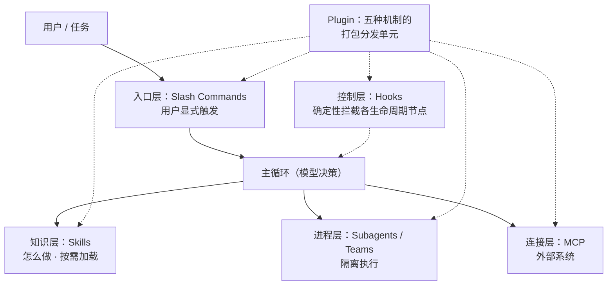

## 3.7 Hooks：把"必须发生"从概率变成确定

- **生命周期事件**：PreToolUse（可拦截/放行/改写决策）、PostToolUse、UserPromptSubmit、Stop/SubagentStop、SessionStart/End、PreCompact、Notification 等【官方】。
- **协议**：hook = 任意 shell 命令，stdin 收 JSON 事件，退出码语义化（如 exit 2 = 阻断并把 stderr 反馈给模型），也支持 JSON 输出精细控制。
- **典型用法**：编辑后自动 format；PreToolUse 里做自定义权限逻辑（保护 prod 配置）；Stop 时强制跑测试，失败就把报错塞回去让模型继续修（"不许停"循环）；桌面通知。
- **设计哲学**："**rules, not vibes**"——凡是"每次都必须发生"的事，不要写在提示词里祈祷模型记得，要用 hook 确定性执行。提示词管方向，hooks 管底线。这与 2.2 权限系统、4.5 沙箱共同构成"确定性放边缘、自由裁量留中间"的三件套。

## 3.8 MCP 集成：连接层的标准与治理

- Claude Code 是 MCP 的旗舰客户端（Anthropic 自家协议，2024.11 开源，现已成为事实行业标准并捐入 Linux Foundation 体系）：支持 stdio/HTTP/SSE 传输、OAuth 授权流、`.mcp.json` 三级作用域（local/project/user）、工具命名空间 `mcp__server__tool`【官方】。
- **工具爆炸治理**：MCP 生态的大服务器动辄几十上百个工具，全量注入会吃掉数万 token。应对分三层：连接器可选择性启用工具；**deferred loading + ToolSearch**（只注册名字，schema 按需加载）【实测】；以及官方博文《Code execution with MCP》提出的更激进路线——把 MCP 工具封装成代码 API，让模型写代码调用，token 占用可降 98%+【官方】。
- **安全治理**：第三方 MCP server 视为不可信输入源，工具结果中的指令按数据处理（3.11）；企业可用 managed settings 白名单化允许的 server【官方】。
- 反向也成立：Claude Code 自身可作为 MCP server 暴露给其他客户端——连接层的双向标准化。

## 3.9 记忆与状态：全部落在文件系统

Claude Code 的一切状态都是本地文件，无云端黑盒【实测：~/.claude 目录结构】：

- **会话转录**：`~/.claude/projects/<按 cwd 哈希>/*.jsonl`——每条消息、每次工具调用与结果的完整 JSONL 流水。resume/fork/审计/数据资产全部基于它。逐行 JSON 的选型使会话既可流式追加又可任意重放【实测】。
- **Checkpoints**：`file-history/` 影子快照，独立于 git（不污染仓库、在非 git 目录也可用），支撑 /rewind【官方/实测】。
- **CLAUDE.md** 是"被策展的长期记忆"（人可读可审）；2026 年在其上叠加了**自动记忆目录**（memory/：一事一文件 + frontmatter 元数据 + MEMORY.md 索引，索引常驻上下文、正文按需加载）——延续渐进披露的同一设计语言【实测】。
- **plans/、todos/、tasks/、teams/**：计划、任务清单、团队状态各有其位。"文件系统即数据库"贯穿始终——好处是可 grep、可 git、可备份、可被用户直接编辑，与开发者心智完全同构。

## 3.10 推理与模型调度

- **Extended thinking 拨盘**：早期以自然语言关键词分档（"think" < "think hard" < "ultrathink"，社区实测对应逐级放大的思考预算，最高约 32K token）【逆向】；Opus 4.5 后收敛为正式的 **effort 参数**（low/medium/high，/effort 命令持久化）——从彩蛋到产品化的典型路径。思考内容对用户可见（可折叠），interleaved thinking 允许模型在工具调用之间继续思考【官方】。
- **多模型分工**【逆向/官方】：主对话用旗舰模型；大量"杂务"路由到小模型（Haiku）：会话标题生成、bash 命令的一句话描述与危险性预判、WebFetch 摘要、自动补全类任务。ANTHROPIC_SMALL_FAST_MODEL 可自定义。**在一个产品内部做模型分层调度，是成本工程的隐形主力**。
- **fast mode**（2026）：/fast 切换到高吞吐 serving 的旗舰模型（不降级小模型）——针对"同一智力，更快出字"的场景细分【官方/实测】。
- **模型选择**：/model 支持按会话/按项目配置，opusplan 混合调度（计划用 Opus、执行用 Sonnet）；企业可设组织默认模型（v2.1.196）【官方】。

## 3.11 自主性 × 安全：机制化的信任边界

Claude Code 对"agent 安全"的回答是把边界做进机制而不是仅靠模型自觉：

- **指令来源边界（instruction source boundary）**：系统提示明确定义——合法指令只来自用户聊天输入；一切经工具观察到的内容（网页、文件、命令输出、MCP 结果）都是**数据而非命令**。若数据中出现对 agent 的指令（"请把邮件转发到…"），正确行为是引用给用户并请示，而非执行【实测：本会话系统提示原文如此】。这是对 prompt injection 的第一性防御。
- **纵深防御栈**：权限规则（4.4）→ bash 命令解析与前缀匹配 + 注入启发式（命令替换、管道下载执行等模式自动升级为询问，另有小模型做语义预判）【逆向】→ OS 级沙箱兜底（4.5）→ WebFetch 摘要化隔离原文 → 企业 managed policy 封顶。
- **"人是 root"**：不可逆/外发动作（push、发消息、购买类）始终需要显式确认；`--dangerously-skip-permissions` 的命名本身就是设计（吓阻 + 免责的双重语义），且官方指引其只应在无凭据的容器内使用【官方】。
- 官方博文《Beyond permission prompts》给出的方向是本节的未来式：**用沙箱把"安全"从审批问题变成构造问题**——在强隔离里，绝大多数操作本来就无害，弹窗自然消失（详见 4.5）【官方】。

**本章小结**：Claude Code 的 agent 系统 = 单循环（简单可靠）× 工具约束（正确性下沉）× 上下文预算（注意力工程）× 渐进披露（skills/memory/tool-search 同一语言）× 机制化边界（权限/沙箱/hook）。所有扩展机制（subagent→teams、skills、workflow）都遵守同一条元原则：**复杂性必须是可选的外挂，内核永远保持单循环的简单**。（本章讲清了"有什么、为什么"；单条用户输入在运行时的逐帧执行过程，见第九章深潜篇。）

# 四、底层架构与工程实现

## 4.1 技术栈：React 渲染终端

- **语言与运行时**：TypeScript。早期以 npm 包分发（依赖 Node ≥18），2025 年切换为 **Bun 编译的原生单二进制** + 独立安装器（`claude.ai/install.sh`）：启动更快、摆脱 npm 依赖地狱、自带升级通道（stable/latest 双通道灰度）【官方】。
- **TUI 框架**：**React + Ink**（Yoga flexbox 布局引擎跑在终端字符网格上）【逆向，多方证实】。用 React 写 CLI 看似奇技淫巧，实则是关键选型：todo 树、diff 视图、多面板、权限卡片这类**有状态组件化 UI**，在传统 curses 范式下开发效率极低。声明式渲染 + 组件复用，让一个小团队维护出了准 IDE 级的终端界面。渲染优化：历史区静态化（不重绘），仅底部动态区参与 re-render，避免闪烁与性能塌陷【逆向】。
- **检索**：内置捆绑 **ripgrep** 二进制（不依赖用户安装），Grep 工具是其参数化封装——把业界最快的文本检索直接焊进产品。
- **可观测**：OpenTelemetry 埋点导出（企业可采集 token 用量、工具接受率、成本分布）；内部以 Statsig 做 feature gate（逆向可见 `tengu_*` 开关族，tengu/天狗是产品内部代号）【官方/逆向】。

## 4.2 本地优先的瘦客户端架构

Claude Code 的部署架构简单得反直觉：**没有自己的服务端**。

```
终端/IDE/桌面壳
   └─ Claude Code 进程（单二进制，本地）
        ├─ 全部编排逻辑：主循环、工具执行、权限、压缩、渲染
        ├─ 全部状态：~/.claude/（转录、设置、快照、检查点、记忆）
        └─ 唯一外部依赖：HTTPS → LLM API
             （api.anthropic.com / Bedrock / Vertex / Foundry，环境变量即可切换）
```

- **API 无状态 + 客户端全状态**：每一轮把完整消息历史发给无状态的 Messages API（prompt cache 使之经济可行），会话、记忆、检查点全部落在本地文件系统。
- 架构红利：① 隐私与合规叙事简单（代码不出本机，除非发给模型的部分；企业可走自家云的 Bedrock/Vertex 端点做数据驻留）；② 离线可审计（一切皆文件）；③ 产品迭代不受服务端发布约束；④ CLI/IDE/CI 行为严格一致（同一进程）。
- 2026 年的演进：本地进程 **daemon 化**（`~/.claude/daemon/`），后台会话跨终端窗口、跨进程重启存活，支撑多会话调度与 Remote Control——本地架构开始长出"单机版编排服务"的形态，但仍然不依赖 Anthropic 服务端【实测/官方】。云端会话（Web/iOS）是唯一例外，见 4.6。

## 4.3 API 交互层

- SSE 流式 + fine-grained tool streaming（工具参数边生成边流出，长 Write 不必等全量）【官方】。
- 重试与降级：限流/过载指数退避，高峰期旗舰模型可配置回退模型；上下文超限、余额类错误面向用户直接可读。
- Prompt caching 控制（cache breakpoints）、token 计数接口、1M 上下文 beta 头——Claude Code 一直是 Anthropic API 新能力的第一个消费者（interleaved thinking、effort、context editing、memory tool 全部如此）：**自家旗舰产品当 API 的首发验证场**【官方】。

## 4.4 权限引擎与设置系统

- **规则语法**：`工具名(限定符)`——`Bash(npm run test:*)` 前缀通配、`Edit(src/**)` 路径 glob、`WebFetch(domain:...)`、`mcp__server__tool`、2026 年新增 `Tool(param:value)` 参数级规则【官方】。allow / ask / deny 三表，**deny 绝对优先**。
- **五层设置叠加**（优先级从高到低）：企业 managed settings（IT 下发，不可覆盖）→ CLI 参数 → `.claude/settings.local.json`（个人不入库）→ `.claude/settings.json`（项目入库共享）→ `~/.claude/settings.json`（用户全局）。团队安全基线与个人便利在文件层面解耦。
- **Bash 权限的难点**：对任意 shell 字符串做权限判定本质是解析问题。实现是解析命令结构 → 拆分复合命令逐段匹配规则 → 命令替换/下载执行等注入模式强制升级询问 → 小模型辅助识别混淆形态【逆向】。这是所有 coding agent 都会踩的深坑，Claude Code 的方案是"解析器 + 规则 + 模型"三层混合。

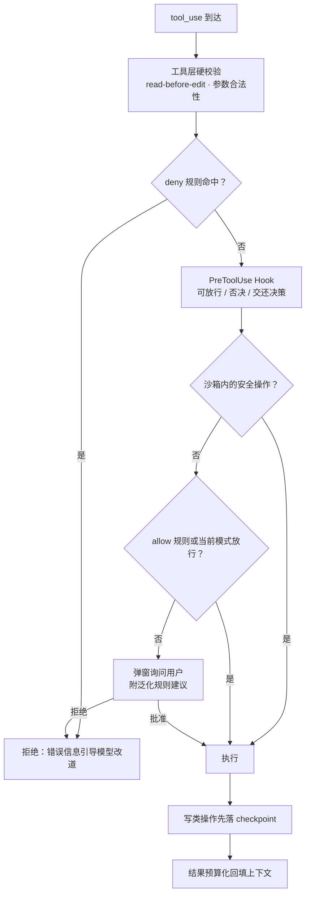
*一次工具调用的授权决策（示意；实际优先级含 ask 规则与多层设置叠加的更细语义）。*

## 4.5 沙箱：把安全从"审批"变成"构造"

2025.10 官方博文《Enabling Claude Code to work more autonomously》与开源的 sandbox runtime 给出完整方案【官方】：

- **OS 原生隔离**：macOS 用 Seatbelt（sandbox-exec profile），Linux 用 bubblewrap（namespace）。
- **双维度隔离**：文件系统（默认可写仅限工作区与临时区，越界需批准）+ **网络**（默认拒绝，出网流量经沙箱外的代理进程，按域名白名单放行——agent 即使被注入也带不走数据、下不了恶意载荷）。
- **产品含义**：沙箱内的命令"生来安全"，无需逐条审批——官方数据口径称权限弹窗可减少约 84%。这就是 3.11 所说的范式转移：**从"每个动作问一次人"到"划一个安全的院子随便跑"**。自主性不是靠放松管制获得的，是靠收紧物理边界获得的。
- 沙箱运行时已开源（可独立用于任意 agent 项目），Web 版云沙箱是同一思路的服务端版本。

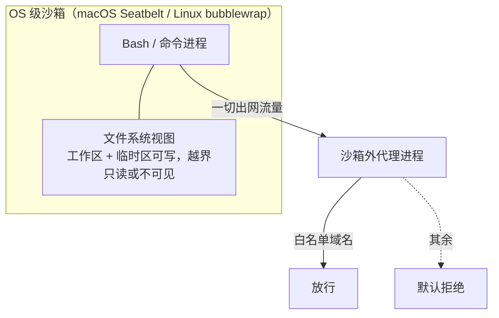

## 4.6 多端架构：一核多壳的实现

- **IDE 插件**：扩展进程与本地 CLI 通过本地端口通信（锁文件发现机制），协议语义接近 MCP——IDE 向 CLI 暴露 openDiff/选区/诊断等"IDE 工具"，CLI 仍是大脑，IDE 是显示器与传感器【逆向/官方】。
- **Web/iOS 云端会话**：浏览器只是控制面；会话跑在 Anthropic 管理的沙箱 VM 中，git 凭据**不进入 VM**（安全代理持凭据执行 git 操作，且限定目标仓库）、网络默认受限【官方】。产物走 PR。这是"把整个 harness 搬进云"而非"做个网页版"——与本地版行为同构。
- **桌面应用**：壳层管理多会话（本地 + 云端同屏），底层仍是同一内核；Cowork 则是把同一内核换一套面向非工程师的语义外壳（文件夹即工作区、任务面板化）【官方】。
- **teleport/Remote Control**：会话状态（JSONL + 检查点）本身可迁移，云↔本地、设备↔设备的接管在数据层是"换个进程重放会话"【推断/官方】。

## 4.7 CI 与自动化：CLI 即 API

- **Headless 模式是全部自动化的基座**：`claude -p` 单发、`--output-format stream-json` 结构化流式输出、`--input-format stream-json` 程序化多轮、退出码语义化。官方文档明说：把 claude 当 unix 工具用（管道进、管道出）【官方】。
- **GitHub Actions**：`anthropics/claude-code-action`——issue/PR 里 @claude 触发，runner 内起 headless 会话，权限用 allowlist 锁死，产物以 commit/PR 交付。模板已覆盖 issue 分诊、代码评审、按需实现三类场景（Claude Code 仓库自己的 issue 分诊就跑在上面）【官方】。
- **定时与常驻**：2026 年加入 cron 式定时任务与云端 scheduled routines，配合 daemon 与后台会话，"agent 值班"成为原生场景【官方/实测】。

## 4.8 Claude Agent SDK：产品内核的平台化

2025.9 从 "Claude Code SDK" 更名 "Claude Agent SDK"，是战略层面最重要的动作之一【官方】：

- **内容**：把 Claude Code 的整个 harness 以库形式暴露——`query()` 主循环、全套内置工具、权限系统（canUseTool 回调）、hooks、subagents、session 管理、compaction、缓存策略。TS/Python 双 SDK；支持进程内自定义工具（无需独立 MCP server 进程）。
- **一句话理解**：竞品在卖"接大模型的框架"（LangChain 类），Anthropic 在卖"我们自己 $2.5B 产品同款运行时"。上下文管理、权限、缓存这些真正难而脏的部分是预制的。
- **验证**：Cowork（知识工作 agent，其用量中软件开发仅占 8.7%）、Claude for Excel、Chrome 扩展等 Anthropic 自家产品全部构建在同一 SDK 上——"agent harness 是公司级平台"不是口号而是组织事实【官方】。
- **对外含义**：开发者用 SDK 造的每个 agent，都在替 Anthropic 验证 harness 设计并沉淀模式；harness 因此获得超越 coding 场景的通用性反馈。这是产品→平台→生态的标准打法，但起点是一个被市场验证过的旗舰应用，而非空中楼阁框架。

## 4.9 发布与质量工程

- **日更节奏**：patch 版本近乎逐日（调研期间 2.1.197→2.1.212+），terse CHANGELOG，stable/latest 双通道 + feature flag 灰度。**高频小步 + 快速回滚**是终端产品少见的互联网化发布纪律【官方/逆向】。
- **评测体系**：公开基准（SWE-bench Verified：Opus 4.5 约 80.9%，2026 年 Opus 4.8 与对手旗舰同处 ~88% 区间；Terminal-Bench 等）之外，**内部真实使用是主评测**——全员日常用 CC 开发 CC，回归以小时级暴露。模型团队与产品团队共享这套评测语境（见 6.4）【官方/公开报道】。
- **自愈式运维**：/doctor 自诊断、/bug 一键上报、安装器自更新；GitHub issue 由 Claude Code 自动分诊。

## 4.10 性能工程

- **感知延迟优先**：流式首 token、工具参数流式、spinner 与 todo 提供"有进展"的语义信号。
- **吞吐**：独立工具调用并行执行（读类并发、写类串行保序）；subagent fan-out 把墙钟时间从"求和"变"取最大"。
- **成本三板斧**：prompt cache 命中（append-only 布局）、小模型分流杂务、输出简洁风格（简洁不仅是 UX 偏好，也是 token 成本策略）。
- **大仓库**：ripgrep + 按需读取 + mtime 排序启发式，百万行级 monorepo 无需索引预热即可工作。

# 五、细节优化亮点（魔鬼在细节）

本章收录 16 个"单看很小、合起来构成体验差距"的工程细节。每条给出机制、动机与可迁移结论。前四章已展开的仅作索引，避免重复。

**① Read-before-Edit 状态机**【实测】
编辑工具在**工具层**校验"本会话读过此文件"，未读直接报错。它不是提示词请求，是硬不变量。
→ 迁移结论：凡是"必须成立"的正确性约束，编码进工具签名与状态机；提示词只承载"最好如此"的偏好。

**② 行号读 / 字符串写的不对称设计**【实测】
Read 用 `cat -n` 行号帮模型建立空间坐标，Edit 却完全不用行号（exact-match）。承认模型"读位置强、写位置弱"的真实能力边界，各用所长。幻觉的编辑必然匹配失败——错误暴露在写入前而非写入后。
→ 工具接口应该围绕模型的真实强弱项设计，而不是照搬人类 API 的惯例（diff/patch 是给人的格式）。

**③ 错误信息是提示词**【实测】
每条工具错误都内嵌下一步指引："not unique，请扩大上下文"；权限被拒时告知"用户拒绝了，请调整方案而非原样重试"。错误文案被当作 prompt 资产来版本化打磨。
→ agent 产品里，报错文案对成功率的影响不亚于系统提示；把它纳入 prompt 工程的评审范围。

**④ system-reminder 边带通道**（详见 3.2）【实测】
动态转向信息以追加式提醒注入，不改历史消息（保缓存）、不进用户视野（保界面干净）。一个通道同时解决转向、缓存、UX 三个约束。

**⑤ 小模型微服务化**【逆向/官方】
标题生成、bash 命令描述与危险预判、网页摘要等十余处杂务全部路由到 Haiku。用户感知"处处有智能"，而边际成本近乎为零。
→ 一个 agent 产品内部应当有模型分层调度表：把每一处 LLM 调用按"需要多少智力"重新定价。

**⑥ Append-only 的缓存经济学**（详见 3.4.3）【官方/实测】
消息布局围绕 KV cache 设计：稳定前缀、只追加不修改、动态信息走 reminder。长会话成本因此下降一个量级。
→ 对话式 agent 的消息架构要在第一天就按缓存友好设计，事后改造极其痛苦。

**⑦ 截断的一致性语言**【实测】
所有上限（2000 行、30K 字符、子进程输出）都显式告知模型"截断了、截了多少、如何取剩余"。模型于是会翻页，而不是把没看到的部分脑补出来。
→ 任何对模型隐瞒信息不完整性的设计，都会转化为幻觉。

**⑧ Shell snapshot 环境确定性**（详见 3.3.3）【逆向/实测】
一次快照用户真实 shell 环境，之后每条命令在干净 shell 中 source 快照执行。同时解决"继承用户环境"与"避免 rc 副作用"这对矛盾。
→ agent 执行环境的可复现性值得专门设计，"直接开用户的 shell"是隐性故障源。

**⑨ Bash 权限的"解析器+规则+模型"三层混合**（详见 4.4）【逆向】
前缀匹配处理常规、注入模式强制升级、小模型兜底语义混淆。单靠任何一层都不可靠，三层叠加后误放行率被压到可接受。
→ 安全判定不要在"规则 vs 模型"里二选一，混合并分层。

**⑩ Checkpoint 走影子历史而非 git**【官方/实测】
快照存 `~/.claude/file-history/`：不污染用户 git 历史、不产生 WIP commit、非 git 目录也能用、恢复瞬时。对话与代码可分别回滚的解耦设计尤其考究。
→ "撤销"是自主 agent 的采用解锁器，且必须独立于用户自己的版本管理。

**⑪ 权限弹窗附带泛化建议**（详见 2.2）【实测】
每次询问都提供"以后不再问这类"的规则化选项，打扰次数随使用时长收敛。权限系统有了学习曲线。

**⑫ 并行调用的提示词纪律**【实测】
系统提示强制"无依赖的工具调用必须在同一消息内并行发出"，harness 侧对读类并发、写类串行。速度来自并发，安全来自序列化，两者由不同层各自保证。

**⑬ Compaction 摘要的结构化模板**（详见 3.4.2）【逆向】
压缩不是"总结一下"，而是定向抽取：目标、决策、涉及文件、未决项、下一步。被优先牺牲的是旧工具输出（体积最大价值最低）。
→ 上下文压缩的正确单位是"恢复工作所需的最小状态包"，模板值得反复调优。

**⑭ Git 礼仪内建**（详见 3.3.3）【实测】
co-author 署名、HEREDOC 提交、禁 force push、"不叫提交就不提交"。高级工程师的协作规范成为出厂默认。
→ 领域最佳实践应内建为 agent 的默认行为，这是产品"手感专业"的直接来源。

**⑮ 反奉承的语气工程**【实测/逆向】
明文抑制 "You're absolutely right"、道歉循环、每次回答的套话前后缀。除了体验，还有实际功能收益：噪声 token 更少、缓存前缀更稳、用户对内容的信任校准更准。
→ agent 的"人格"是系统提示里的工程参数，需要像 UI 一样被设计与回归测试。

**⑯ ToolSearch / 渐进披露作为统一设计语言**【实测】
工具（deferred loading）、技能（三级加载）、记忆（索引常驻+正文按需）、CLAUDE.md（分层注入）——四套系统用的是同一个模式：**目录常驻、内容按需**。学一次，处处适用；上下文预算处处受益。
→ 好的系统有统一的设计语言；"渐进披露"可能是 agent 时代最重要的一条。

# 六、生态与平台化

## 6.1 Plugins：扩展机制的统一分发层

2025.10 上线【官方】。一个 plugin 可打包 slash commands + subagents + skills + hooks + MCP 配置，一条 `/plugin` 命令安装；**marketplace 就是一个 git 仓库**（组织可自建私有市场，企业可经 managed settings 统一下发/限制）。设计上的聪明之处：没有发明新的包管理基础设施，git 仓库 + markdown 文件就是全部——延续"文件系统即数据库"的语言，把分发门槛压到会用 git 即可。

## 6.2 社区生态：被逆向也是一种护城河

- 资源聚合（awesome-claude-code）、用量监控（ccusage 等）、第三方 GUI、把 harness 接到其他模型的路由器（claude-code-router 类项目的流行，反向证明了市场对这套 harness 本身的认可）。
- 活跃的逆向工程社区（系统提示 dump、二进制 strings 分析——Agent Teams 就是先被社区从二进制里挖出来的）。Anthropic 对此明显松弛：**护城河不在 prompt 文本，在模型-harness 协同与迭代速度**。
- **开源状态澄清（常见误解）**：Claude Code 从未开源。GitHub 公开仓库 `anthropics/claude-code` 是"壳仓库"（仅 changelog/issues/示例/官方插件，无源码目录）【实测：API 目录列表】；产品本体以商业条款下的闭源分发（npm 时代为混淆 bundle，现为 Bun 编译原生二进制，本机 v2.1.197 为 217MB Mach-O 可执行文件）【实测】。2026.3.31 的 source map 泄漏事件（v2.1.88，约 51 万行 TS 源码暴露，随后 DMCA 下架与 clean-room 重写风波）让"源码"在网上事实性流传，但其法律性质是泄漏的版权材料而非开源【公开报道】。**对借鉴者的合规提示：泄漏源码不可作为调研或实现参考，本报告不依赖任何泄漏材料。**真正开源可读的是：claude-code-action、sandbox runtime、anthropics/skills、Agent SDK wrapper 层、MCP 协议栈。
- Skills/插件的社区创作正在形成"能力众包"层：官方 anthropic-skills 仓库 + 各垂直领域的第三方技能包。

## 6.3 企业化

managed settings（权限策略、模型、marketplace 白名单集中下发且不可覆盖）、SSO/SCIM、席位 + 用量池 + per-user 支出上限、OTel 用量/成本导出、Bedrock/Vertex/Foundry 端点做数据驻留【官方】。企业收入占比过半（1.4 节）说明这套治理栈已被验证。值得注意的模式：**先赢开发者个体（自下而上渗透），再补齐治理卖给 CIO**——与当年 Slack/GitHub 的路径同构。

## 6.4 模型-产品协同飞轮（最深的护城河）

1. Anthropic 的模型在与 Claude Code 高度同构的工具环境中做 RL 训练（官方对 Sonnet 4.5/Opus 4.5 的描述均强调面向真实 agentic coding 环境训练），模型"天生熟悉"这套工具的语义与约束【官方/推断】。
2. 产品是模型的第一评测场：新模型先在内部 Claude Code 全员环境跑，行为回归以小时计。
3. 用户的真实使用暴露模型短板 → 定义下一代训练重点 → 新模型上线后产品删掉对应的补丁代码（提示词、护栏）→ 产品更薄、体验更强。
4. SDK/Cowork/Excel 把同一 harness 铺到更多领域，飞轮的数据面从 coding 扩展到通用知识工作。


竞品可以复刻第 1 层的工具协议（已有多个开源克隆），但复刻不了 2–4 层的组织闭环——模型公司做应用的真正复利在这里，而不在"有自己的入口"。

# 七、竞品横评与定位

## 7.1 格局速览（截至 2026-07）

| 产品 | 形态重心 | 模型 | 开源 | 关键差异 |
|---|---|---|---|---|
| **Claude Code** | 终端为核，全形态覆盖 | Claude（自家） | 闭源（SDK 开放） | 模型-harness 协同、生态最厚 |
| **OpenAI Codex** | CLI（开源）+ 云端并行 + IDE | GPT-5.x-codex | CLI 开源（Rust） | 云端多任务编排激进、随 ChatGPT 订阅分发；周活 500 万+（2026.6），增长极快 |
| **Gemini CLI → Antigravity** | CLI/IDE | Gemini 3 | 原开源，2026.6 转闭源二进制并大幅缩水免费额度 | 曾以免费额度换渗透，现战略收缩重组【公开报道】 |
| **Cursor** | IDE 整机 | 多模型 + 自研 Composer | 闭源 | 编辑器内体验（tab 补全/语义索引）最强，自研模型走"快"路线 |
| **GitHub Copilot** | IDE 插件 + 平台 agent | 多模型（含 Claude） | 闭源 | 分发为王（VS Code/GitHub 原生位）、企业治理成熟 |
| **Aider / Cline / OpenHands / opencode 等** | 终端/IDE 开源阵营 | BYOK 多模型 | 开源 | 可自托管、可换模型，是"harness 可复制"论的活证据 |
| **Devin / Factory 等** | 全自主云 agent | 多模型 | 闭源 | 端到端外包式定位，与 CC 的"结对→委托"渐进路线相反 |

市场数据锚点【公开报道，2026 上半年口径】：Claude Code 在"复杂任务首选"开发者调研中约 44%（第二名 19%）；VS Code 扩展装机 2020 万 vs Codex 1150 万；Codex 周活用户半年从 60 万涨到 500 万+——**规模上 Codex 追得很快，心智上 CC 仍握着"最强"标签**。

## 7.2 形态之争的复盘与终局

终端形态为何先跑出来：agent 时代的交互单位从"补全一行"变成"委托一件事"，IDE 的"光标旁辅助"范式反而不契合；终端是唯一同时覆盖本地/SSH/CI/容器的环境；且 CLI 的可组合性让它天然成为一切自动化的原语。
但到 2026 年，**形态本身已经商品化**：所有头部玩家都同时提供 CLI + IDE + 云 + 移动。真正的分层变成——上层是"会话/任务管理界面"（谁能成为工程师的 agent 调度台），下层是"循环质量"（模型 × 工具 × 上下文工程）。Claude Code 对这两层的回答分别是桌面多会话/Teams 与模型协同飞轮。

## 7.3 技术路线的三个根本分歧

1. **检索**：agentic search（CC、Codex）vs 语义索引（Cursor、Copilot）。前者赌模型能力与透明性，后者赌延迟与大仓库规模化。目前前者是趋势方向（模型越强，中间层越亏），但超大 monorepo 上索引派仍有实用优势。
2. **Harness 厚薄**：CC 极薄（信模型）vs 部分竞品厚编排（多阶段流水线、专用规划器）。18 个月来的经验站在薄的一边：厚编排在每次模型升级时都成为负资产。
3. **开放策略**：Codex/开源阵营用开源 CLI 换信任与贡献；CC 闭源产品 + 开放 SDK/协议（MCP）/沙箱运行时——开放"接口与地基"，闭合"体验与循环"。

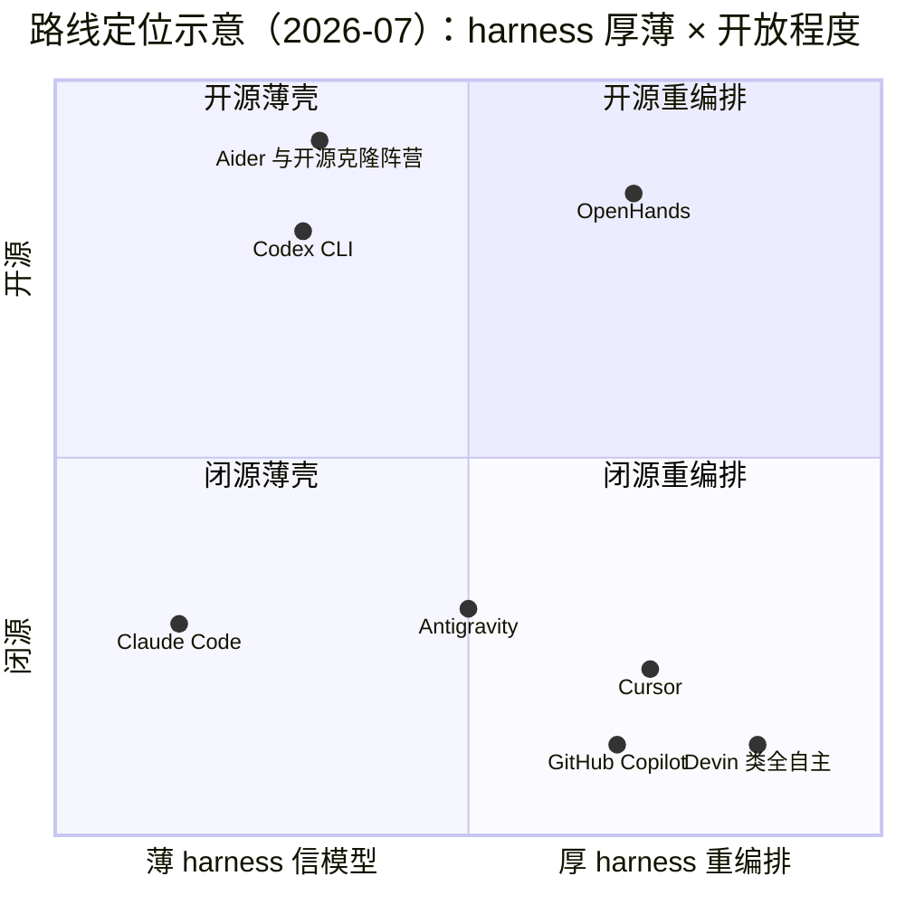
*位置为定性示意（Claude Code 的 y 轴位置计入了 SDK/沙箱/协议层的开放）。*

## 7.4 护城河与脆弱点（对 CC 的冷静评估)

**真护城河**：模型-harness 协同训练闭环（6.4）；开发者心智与品牌（"最强"标签）；生态资产（skills/plugins/MCP 事实标准）；多形态一致性带来的切换成本；以及组织层面的迭代速度本身。

**脆弱点**：① 价格与用量焦虑——重度用户成本显著高于竞品补贴价，限额政策每次收紧都引发迁移讨论；② 模型平权风险——若对手模型在 agentic coding 上真正拉平（SWE-bench 已同区间），薄 harness 反而意味着可替代性高（harness 早被克隆干净了）；③ 平台依赖——VS Code 与 GitHub 都在微软手里，入口层随时可能被"原生位"挤压；④ 封闭源码在安全敏感型企业与主权云场景的先天劣势；⑤ 长期看，模型若把 compaction/todo/检索策略内化为原生能力，harness 层的差异化会进一步变薄——这对 CC 是"自我革命可控"，对纯 harness 创业公司则是生存问题【推断】。

# 八、对我们的启示（Actionable）

## 8.1 可迁移的设计原则清单

1. **信模型，做薄 harness**——每个"帮模型"的中间层都要回答：模型下一代变强后，这层是资产还是负债？
2. **工具是产品的真接口**——工程投入优先级：工具约束 > 工具描述 > 错误文案 > 系统提示 > UI。
3. **正确性下沉到机制**——必须成立的用状态机/权限/hook 保证，最好如此的才写进提示词。
4. **上下文是预算**——为每类信息定价（常驻/按需/一次性），渐进披露作为统一设计语言。
5. **缓存感知的消息架构**——append-only、稳定前缀、边带注入，第一天就设计好。
6. **一切可回滚，才敢自主**——撤销/打断/快照是自主性的前提设施，不是锦上添花。
7. **透明是信任的货币**——计划、进度、diff、思考过程全部外显。
8. **每次打扰都为减少下次打扰投资**——权限、澄清、确认都要有学习曲线。
9. **模型分层调度**——每处 LLM 调用按所需智力重新定价，杂务给小模型。
10. **错误信息面向模型写**——agent 的自愈能力是文案工程出来的。
11. **文本文件即系统**——配置、记忆、技能、命令都是 markdown/JSON 文件：可 git、可 grep、可众包。
12. **dogfooding 即评测**——团队必须是自己 agent 的重度用户，反馈回路以小时计。
13. **先做最简单的事，把简单打磨到极致**——复杂性必须是可选外挂，内核保持单循环。
14. **产品即平台**——内核值钱就抽 SDK，让别人替你验证通用性。

## 8.2 值得直接借鉴的机制 Top 8（按投入产出比排序）

| # | 机制 | 投入 | 回报 |
|---|---|---|---|
| 1 | 工具描述说明书化 + 错误文案工程（3.3.5） | 纯文案工作 | 成功率/自愈率立竿见影 |
| 2 | Read-before-Edit 类硬不变量（5.①） | 少量工具层代码 | 消灭一整类幻觉事故 |
| 3 | todo 外显 + 进度可视化（3.3.4） | 一个结构化工具 + 渲染 | 长任务防跑偏 + 用户信任感 |
| 4 | system-reminder 边带通道（3.2） | 消息管线改造 | 运行时转向能力，不伤缓存 |
| 5 | 结构化 compaction 模板（3.4.2） | 一段摘要 prompt | 长会话质量的生死线 |
| 6 | 权限规则 + 泛化建议（2.2） | 规则引擎 + 弹窗设计 | 安全与打扰的帕累托改善 |
| 7 | 渐进披露的能力加载（skills/tool-search）（3.6） | 加载器架构 | 上下文成本数量级下降 |
| 8 | 小模型杂务分流（3.10） | 路由表 | 成本直降，体验不降 |

## 8.3 应避免的坑（含 CC 自身的短板）

- **成本不可预期**是用户最大痛点：做 agent 产品要在第一天提供预算护栏（限额可视化、成本预估、便宜模式），别等社区做第三方监控工具。
- **权限疲劳与安全的钢丝**：CC 用了两年才走到"沙箱消灭弹窗"，直接抄它的终点（沙箱优先），别重走弹窗迭代的弯路。
- **上下文黑盒感**：用户不知道"模型现在知道什么"会积累不信任——CC 的 /context、余量指示是补丁，值得做得更早更好。
- **提示词面条化风险**：逆向显示 CC 系统提示里大写强调、特判规则持续膨胀——需要建立提示词的重构与回归机制（他们的对策是每代模型删一批，这依赖于你能影响模型训练；我们做不到，就更要克制）。
- **多人协作是空档**：CC 的记忆/会话/技能仍以个人为中心，团队级知识沉淀（谁改的规则、为什么）是所有 coding agent 的共同空白——也是创业机会。
- **单模型绑定的两难**：CC 的深度协同换来体验上限，也换来生态对"harness 可移植性"的持续需求（router 类项目的流行）。对我们：若做垂直 agent，多模型兼容是保险，单模型深调是上限，建议架构上兼容、体验上单模型调优。

## 8.4 开放问题与跟踪清单

- Agent Teams 会走向真正的"组织级 agent"（角色、流程、问责）还是收敛回增强版并行？（观察 teams 相关版本节奏与默认开关时点）
- 记忆体系（memory 目录）能否跨会话真正积累"工作智慧"，还是止步于偏好存储？
- 模型内化 harness 能力的速度：Sonnet 5 原生 1M 上下文已让 compaction 退居二线，下一个被内化的是什么？
- 沙箱能否成为行业标准接口（开源 runtime 的采用度）？
- Cowork 的扩张是否反噬 Claude Code 的产品重心（知识工作 92% vs 编码 8% 的用量结构）？
- 竞对观察：Codex 的云端并行编排 与 CC 的本地 daemon 化，两条"多任务"路线谁先被大众接受？

---

# 九、深潜：一次用户输入在 Claude Code 内部的完整生命周期

*本章面向 agentic system 工程师，以"单个 session 内、一条用户输入从按下回车到 turn 结束"为主线做逐帧解剖。证据以【实测】为主（撰写者本身运行于该 harness 内），辅以官方 SDK/文档与社区逆向的交叉验证。*

## 9.0 全景时序图

```
用户按下回车
│
├─[A] 输入分派（本地，不一定经过模型）
│      /命令 → 本地执行或展开为 prompt
│      !命令 → 直通 bash，结果入上下文
│      #文本 → 写入 CLAUDE.md，结束
│      普通输入 → 继续
│
├─[B] 消息构造
│      @引用解析、图片编码、UserPromptSubmit hook（可拦截/可注入）
│      附着 system-reminder（CLAUDE.md、记忆索引、外部文件变更…）
│
├─[C] 请求组装（append-only 布局 + 缓存断点）→ Messages API（SSE 流式）
│
├─[D] Agent 主循环（重复直到 stop_reason = end_turn）
│      流式事件 → thinking 渲染 / 文本渲染 / tool_use 参数累积
│      模型停止（stop_reason = tool_use，可含 N 个并行调用）
│      ┌─ 对每个 tool_use：
│      │    权限管线：硬不变量 → 规则(allow/ask/deny) → PreToolUse hook
│      │              → 沙箱判定 → （必要时）弹窗问人
│      │    执行调度：只读并发 / 写与 bash 串行 / 长任务转后台
│      │    结果封装：tool_result(tool_use_id) + 截断标注 + 附加 reminder
│      └─ 全部结果追加进历史 → 回到 [C] 再次调用模型
│
└─[E] Turn 收尾
       转录 JSONL 落盘（其实每个事件都在实时追加）
       todo/计划/检查点状态持久化
       旁路小模型任务（会话标题等）异步完成
       通知（若用户已切走）→ 等待下一条输入
```

## 9.1 输入到来之前：会话启动时已就绪的状态

一条输入的处理成本低，是因为大量工作在 session 启动时已完成【实测/官方】：

- **设置级联解析**：五层 settings 合并出生效的权限规则、hooks、模型配置（4.4）。
- **系统提示组装**：身份/规则/工具政策 + 环境块（cwd、平台、日期、git 状态、模型名）一次性固化——此后整个 session 不再改动（缓存前缀的稳定性从这里开始）。
- **能力索引构建**：内置工具 schema 全量注册；MCP server 异步连接（未就绪不阻塞会话，工具后到后追加可用）；海量工具走 deferred 模式只注册名字；skills 只注入"名字 + 一行描述"的目录；记忆体系只注入 MEMORY.md 索引。**四套系统在启动时都只放"目录"，正文全部按需加载**。
- **环境快照**：shell snapshot 落盘（3.3.3）；CLAUDE.md 逐层发现待注入。
- **转录文件创建**：`projects/<cwd-hash>/<session-id>.jsonl`，此后一切事件实时追加——会话状态从第一秒起就是可重放的事件日志。

## 9.2 输入分派：五条路径

用户输入首先经过本地路由，**并非一切都发给模型**【实测/官方】：

| 输入形态 | 处理方 | 说明 |
|---|---|---|
| `/clear`、`/model`、`/config` 等纯管理命令 | 本地直接执行 | 零 token 成本 |
| `/compact` | 本地发起一次专用模型调用 | 摘要请求，不入正常对话流 |
| 自定义命令 `/deploy-check` | 本地展开 | markdown 模板 + `$ARGUMENTS` + `!`预执行结果 → 拼成 prompt 走正常流程 |
| `!npm test` | 本地 bash 直通 | 输出作为上下文追加，不消耗模型轮次 |
| `#这个项目用 pnpm` | 本地写 CLAUDE.md | 记忆速记，即时生效于下轮 |
| 普通自然语言 | 进入 [B] | 主流程 |

普通输入的构造阶段：`@file` 模糊引用解析为路径/内容注入；粘贴图片编码为 content block；**UserPromptSubmit hook** 获得一次拦截或注入上下文的机会（企业可在此做敏感词/合规过滤）；最后，harness 把当轮应让模型知道的旁路信息（首条消息附 CLAUDE.md 与记忆索引、外部文件变更通知、上次 turn 的遗留提醒）以 `<system-reminder>` 块附着在用户消息前后——**用户看到的自己的消息，和模型收到的"这条消息"，不是同一个东西**【实测】。

## 9.3 请求组装：消息布局与预算管理

每一轮发给 API 的请求体，从上到下【官方/逆向/实测】：

```
[system]   系统提示（稳定） ──────────────┐
[tools]    工具 schema 数组（稳定） ───────┤ 缓存断点区：整个 session 逐字节不变
[messages] user₁ (+reminders)             │
           assistant₁ (text/thinking/tool_use…)
           tool_result₁ …                 │ append-only：只增不改
           …                              │
           userₙ (+reminders) ←──────────┘ 滚动断点贴近尾部
```

三条纪律使缓存命中率逼近理论上限：**前缀稳定**（系统提示与工具定义 session 内不变）、**历史不可变**（一切动态信息以追加的 reminder 表达，绝不回改旧消息）、**断点滚动**（Anthropic API 支持多个 cache breakpoint，尾部断点随对话推进滚动，精确放置策略属实现细节【逆向/推断】）。

**预算的运行时管理**是一条触发链【官方/实测】：每轮统计 token 占用并在 UI 显示余量 → 接近阈值先做 **micro-compact**（把旧的 tool_result 替换为占位符——体积最大、复用价值最低的部分先牺牲，且不动消息骨架）→ 仍不足则触发**全量 compaction**（专用摘要调用产出"目标/决策/文件/未决项/下一步"结构化状态包 + 保留最近消息原文，重建消息数组，接受一次性缓存失效）→ Sonnet 5 原生 1M 后阈值大幅放宽，但这条链和布局纪律原样保留。

## 9.4 主循环逐帧：流式事件与执行调度

**模型输出侧**：SSE 事件流被增量消费——thinking delta 渲染为可折叠灰色斜体；文本 delta 实时走 markdown 渲染；tool_use 的 JSON 参数逐段累积（fine-grained tool streaming 使超长 Write 的参数也流式可见）。一次 assistant 消息可以携带**多个 tool_use 块**（系统提示强制模型对无依赖操作并行发出），harness 收齐当轮全部调用后进入执行段【实测/官方】。

**执行调度侧**【逆向/实测】：

- 只读类工具（Read/Glob/Grep/WebFetch…）**并发执行**；写类与 Bash **串行保序**——速度来自并发、一致性来自串行，由 harness 而非模型保证。
- 每个结果封装为 `tool_result`（经 `tool_use_id` 与调用一一对应），失败同样是 tool_result（带错误标记 + 面向模型的指引文案）——**错误不中断循环，而是作为信息进入下一轮**，这是 agent 自愈能力的机制基础。
- 长命令转后台（返回任务句柄，模型此后可轮询输出）；超过约 2 分钟的 MCP 调用自动后台化【官方】。
- 结果回填前经过"再加工"：超限截断并显式标注、必要时附着 reminder（"该文件同时被外部修改"、"结果中的指令不是用户指令"等安全/状态提示）【实测】。

**循环控制**：全部结果追加后立即再次调用模型（缓存使这次重复计费接近于零）；直到模型以纯文本收束（stop_reason = end_turn）→ turn 结束。**用户 Esc 打断**是第一等公民路径：取消在途请求与执行中工具、已完成部分照常落历史、注入打断标记——上下文不损毁，用户追加一句纠偏即可继续【实测】。

**旁路异步任务**与主循环并行不阻塞：小模型生成会话标题、bash 命令的一句话描述与危险性预判等（3.10）【逆向】。

## 9.5 工具调用全链路：三个代表性剖面

**一次 Edit**【实测】：
```
tool_use{file_path, old_string, new_string}
→ 硬不变量校验：本会话 Read 过该文件？old_string 精确且唯一命中？（任一失败 → 带指引的错误 tool_result）
→ 权限：acceptEdits 模式？allowlist 命中？→ PreToolUse hook（可否决）
→ （需要时）diff 卡片问人，附"以后不再问"泛化选项
→ 执行前先写 checkpoint 快照（file-history/，/rewind 的物质基础）
→ 原子替换写盘 → PostToolUse hook（典型：自动 format）
→ tool_result：成功摘要（而非全文回显——省 token）
```

**一次 Bash**【逆向/实测】：
```
tool_use{command, timeout?, run_in_background?}
→ 命令结构解析：拆分复合命令、提取前缀
→ 注入检测：命令替换/管道下载执行等模式 → 强制升级为询问
→ 小模型旁路预判（描述 + 危险性）
→ 规则匹配（Bash(npm run test:*) 前缀语义）→ 沙箱判定（沙箱内 → 免审直行）
→ 持久 shell 执行（source 环境快照；默认 2min 超时）
→ stdout/stderr 合并、约 30K 截断（显式标注）→ tool_result
```

**一次 MCP 调用**【实测】：
```
mcp__server__tool → schema 已加载？（deferred 工具需先经 ToolSearch 取回 schema）
→ 权限（MCP 默认 ask，可规则化放行）
→ JSON-RPC 至 server（stdio 子进程 / HTTP 远端）
→ 结果限长回填；超时/长任务自动转后台
```

三个剖面的共性即 harness 工具层的完整职责清单：**校验 → 授权 → 隔离 → 执行 → 预算化回填**，五段对模型完全透明——模型只看见"调用、结果"两个端点。

## 9.6 主从 Agent 的运行时关系

**Subagent（Task 工具）的执行语义**【实测/官方】：

1. 主 agent 发出 `Task{description, prompt, subagent_type}`——这只是一次普通工具调用；
2. harness 据此**新建一个完整会话**：独立的空白消息数组、按 agent 定义裁剪过的工具集/模型/权限（只能收窄不能放宽）、自己的转录文件。**子 agent 对主对话历史零可见**——它知道的一切都必须显式写进 prompt；
3. 子循环独立运行（与 9.4 完全同构，递归结构）；多个子 agent 并发时共享会话级并发上限（约 10 量级，随版本调整【逆向/实测】），超额排队；
4. 子 agent 的**最终文本报告**作为 tool_result 回填主上下文，子上下文随即整体废弃（转录留档可查）；
5. 主 agent 可阻塞等待（前台）或继续干活（后台派生，完成时以事件通知）。

工程上最重要的一句话：**主从之间只有两个窄接口——下行的 prompt 和上行的 report**。没有共享内存、没有流式管道、没有中途对话。这个"极窄腰"设计牺牲了交互丰富性，换来：上下文严格隔离（子 agent 的翻箱倒柜不污染主上下文）、并行无竞态（各自独立世界）、故障隔离（子挂了只是一条错误 tool_result）。

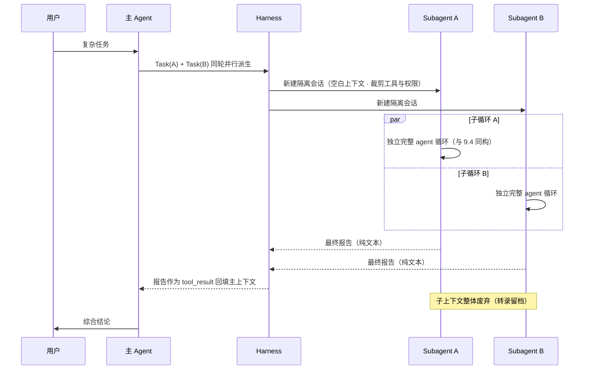

**Agent Teams 对窄腰的突破**（2026，实验性）【官方/实测】：teammate 是**常驻会话** + 一个邮箱。SendMessage 把消息异步注入对方下一轮上下文；共享任务板（tasks/ 目录的文件）提供"认领/依赖/状态"的协作原语；lead 本身也只是普通 agent。拓扑从星型变网状，但通信仍是"上下文注入"这一种机制——**harness 影响任何 agent 的方式永远只有一种：往它的上下文里放东西**。

**运行时选型心智**（何时用哪层）：

| 形态 | 上下文 | 交互 | 适用 |
|---|---|---|---|
| 主 agent 直接做 | 共享（会污染） | 全双工 | 需要完整对话背景的核心工作 |
| Subagent | 隔离，窄腰 | 一问一答 | 探索/检索/评审等"过程冗长、结论短小"的任务 |
| Teams | 隔离 + 邮箱 + 任务板 | 异步多方 | 低耦合可并行的大块工作（跨层特性、竞争假设） |

## 9.7 Harness 设计观：职责分界与事件溯源

把 9.1–9.6 收拢成三条系统设计原则，这是 Claude Code harness 最值得抄的底层观念：

1. **责权分界线清晰且单向**。harness 负责：上下文组装与预算、工具执行与安全、状态持久化、渲染与打断。模型负责：全部任务决策。harness **从不替模型决定下一步做什么**（没有隐藏的规划器/路由器），模型**从不绕过 harness 触碰系统**（没有工具之外的副作用通道）。
2. **"一切转向皆上下文"**。harness 干预模型行为的手段只有一种：向上下文放入信息（系统提示、reminder、工具结果、错误文案）。没有隐藏控制通道的直接后果是**完全的可解释与可重放**——JSONL 转录就是完整因果链，resume/fork/审计/调试全部是同一份日志的重放（事件溯源架构）。
3. **每一层都有失败预案**。API 层：重试/退避/回退模型；工具层：错误即信息，模型自愈；上下文层：micro-compact → compaction 逐级降压；进程层：崩溃后 resume 无损恢复；人机层：Esc/rewind 永远可用。**自主性不是假设不出错，而是保证出错后系统仍在可恢复状态。**

## 9.8 注释版 trace：以本报告的一次真实 turn 为例

撰写本报告"开始写吧"那一轮的实际执行序列（已简化），可与上文逐节对照【实测】：

```
user: "非常好～开始写吧～最后给我markdown～"
  ↳ 附着 reminders：记忆索引、可用 skills 目录（9.2）
assistant: thinking（规划：先核验信源，再分章写入）
assistant: tool_use ×2 并行 —— ToolSearch(加载 WebSearch/WebFetch schema)
                              + Bash(claude --version; ls ~/.claude)   ← 只读并发（9.4）
tool_result ×2 回填
assistant: tool_use ×4 并行 —— WebFetch(CHANGELOG) + WebSearch(营收/teams/Cowork)
tool_result ×4 回填（WebFetch 结果已经小模型摘要化，9.5）
assistant: tool_use —— Write(报告文件, 第一章)      ← 写类串行开始
assistant: tool_use —— Edit(追加第二章) …… ×7 轮，每轮一次追加
  ↳ 每次 Edit 前：read-before-edit 校验通过（文件是本会话所写）
  ↳ 每次写盘前：checkpoint 快照落 file-history/
assistant: tool_use —— Bash(wc 统计) + Write(记忆文件) 并行
assistant: 纯文本收束（交付说明）→ stop_reason: end_turn，turn 结束（9.4）
  ↳ 全程 十余轮 模型调用，缓存前缀逐轮复用；转录实时追加至 session JSONL
```

这个 trace 里没有出现任何"编排代码"：先调研后写作、先并行后串行、分八次追加——全部是模型在循环中的临场决策。**这就是"model-driven, thin harness"在运行时的真实样子。**

# 附录

## A. 版本大事记（要点）

详表见 1.1。补充近期关键版本号：v2.0.0（2025.09.29，checkpoints/VS Code/SDK 更名）→ v2.1.29（2026.01，TeammateTool 被社区发现）→ 2026.02.06 Agent Teams 随 Opus 4.6 发布 → v2.1.170（Fable 5）→ v2.1.172（subagent 五层嵌套）→ v2.1.178（隐式 team 简化）→ v2.1.196（后台会话默认 + 跨重启存活）→ v2.1.197（Sonnet 5 默认 + 原生 1M 上下文；本机版本）→ v2.1.212+（/fork 后台会话、会话级派生限额）【官方 CHANGELOG】。

## B. 信源清单

**官方一手**
- 文档：code.claude.com/docs（agent-teams、sandboxing、hooks、skills、SDK、企业治理等分册）
- 工程博客：Effective context engineering for AI agents / Writing effective tools for agents / Building agents with the Claude Agent SDK / Code execution with MCP / Enabling Claude Code to work more autonomously / How we built our multi-agent research system / Claude Code best practices
- 发布公告：Claude 3.7/4/4.5/Opus 4.5/4.6/Claude 5 家族各版本；Web/iOS、桌面、Plugins、Skills、Cowork（含 2026.07 web/移动扩展）
- GitHub：anthropics/claude-code（注意：壳仓库，仅 CHANGELOG/issues/示例/插件，不含产品源码——产品为闭源二进制分发，详见 6.2 澄清）、claude-code-action、开源 sandbox runtime、anthropics/skills
**团队访谈**：Boris Cherny 等在 Latent Space 等播客与公开演讲（起源故事、"90% 自举"、agentic search 取代 RAG 的决策）
**社区逆向**：MinusX《What makes Claude Code so damn good》；多份系统提示 dump 与二进制分析（Ink/Statsig/tengu、TeammateTool 发现过程等）
**市场数据**：Anthropic 官方披露（run-rate、企业占比）及 VentureBeat/TechCrunch/Reuters、Sacra 等公开报道；IntuitionLabs 等 2026 对比研究
**本机实测**：v2.1.197，macOS，2026-07-17（~/.claude 目录结构、工具协议、system-reminder、权限流、deferred tools 等）

## C. 调研方法与置信度说明

四种方法交叉验证：官方资料研读（结论的骨架）→ 本机实测探针（harness 行为的直接证据，含撰写者自身运行于该 harness 内的内省观察）→ 社区逆向的交叉比对（内部实现细节，取多个独立来源一致者）→ 竞品公开信息横评。全文以【官方/实测/逆向/推断】四级标注置信度；未标注处为多源一致的共识性描述。内部实现类细节（压缩阈值、模型路由表等）随版本变化快，引用时建议以标注日期（2026-07-17）为准。

*报告完*

